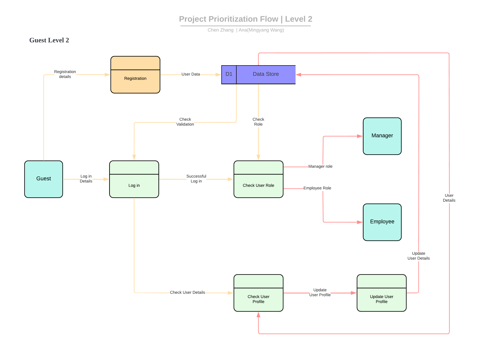
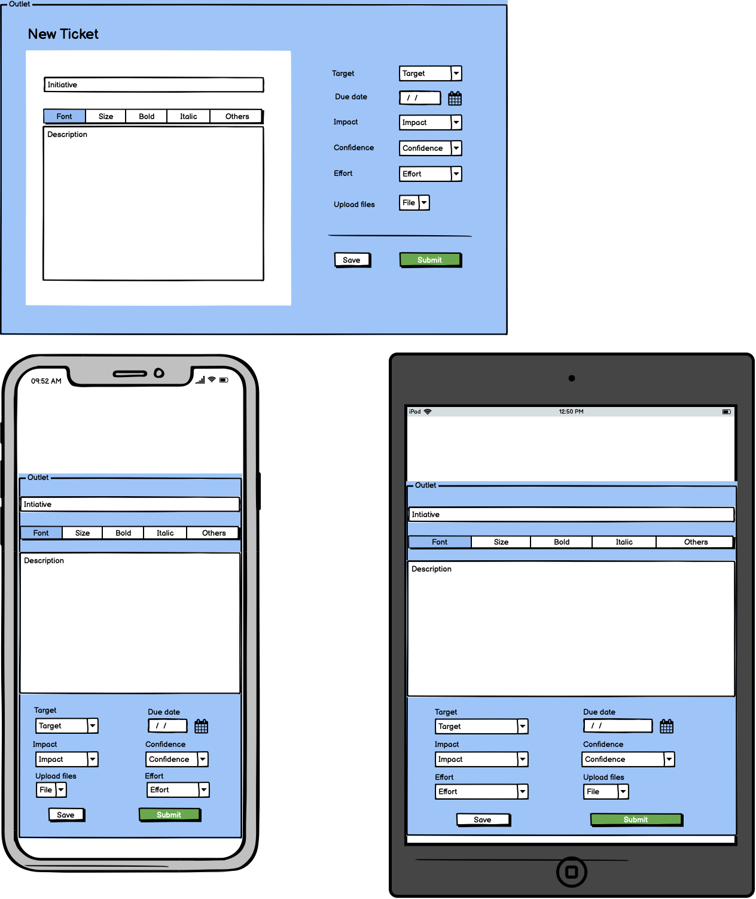

## Project Prioitization - T3A2 Part A

---

### By Chen Zhang && Mingyang (Ana) Wang

---

## R1. Description of your website, including

- **_Purpose_**

  - The purpose of this project management application is to collect and track ideas from users and prioritise their projects to improve team productivity. The Teams and Subscriptions Marketing (TSM) team is responsible for building marketing landing pages for Business to Business (B2B) at Canva. The current problem that they face is their manual process for project prioritisation.

  - The TSM team constantly gets a lot of requests from other teams globally across Canva to create, update or localise (translate to different languages) landing or existing pages. Every season (3 months period) they have to build a roadmap of all the things that they want to work on which is a complicated process as they always have more work than the team can handle and it’s not always clear what is the most important for Canva. The consequence of this unclear path is that their process of prioritisation of projects can be very chaotic. The team has to figure out how to use their limited time to work on the most important projects that will make a big impact for the company. At the same time, they also have to demonstrate their roadmap to leadership to make sure it’s aligned with the overall strategy of the company.

  - Our project management application will help the TSM team to collect ideas from various people at Canva and add relevant context/additional information to each idea. The application will also automatically calculate the ICE score that is required by the managers for their decision-making process. It allows managers to provide feedback for each idea so people can review their ideas. This application will let users be free from those manual spreadsheets and improve their productivity.

- **_Functionality / features_**

  - Our application will have the following functionality / features:

  - Enable users (both employees and managers) to register the application (authentication)

  - Allow users to submit their ideas

  - Allow users to add, edit, and delete their ideas before submission (authorisation)

  - Automate calculate ICE score

  - Enable users to view their own project history (including both submitted and un-submitted projects), all the submitted projects and managers’ feedback

  - Enable managers (only) to view their feedback history (including both submitted and un-submitted feedback)

  - Allow managers (only) to add, edit, and delete their feedback before submission

  - Allow managers (only) to edit other users' ICE scores (impact, confidence, and effort)

  - Enable users to search for projects

- **_Target audience_**

  - Our target audiences are all the employees in Canva and the managers in Canva's Teams and Subscriptions Marketing.

- **_Tech stack_**

  MERN full stack app:

  - Front-end: React interacts with users, JavaScript, HTML

  - Back-end: Express for web frame work, Node.JS for web server, Mongoose for a connection between MongoDB and the Node.js JavaScript runtime environment

  - Database: MongoDB processes and stores database

  - Styling framework: Material UI, CSS

  - Deployment: Netlify for front-end, Heroku for back-end

  - Cloud-storage service: AWS S3 Bucket feature to storage our uplodaded images

## R2 Dataflow Diagram

 DFD Levle 0

 

DFD Levle 1

 

DFD Levle 2

## R3 Application Architecture Diagram

## R4. User Stories

<table> 
  <tr>
    <th style="text-align:center">Theme</th>
    <th colspan=2 style="text-align:center">Employee</th>
    <th colspan=2 style="text-align:center">Manager</th>
  </tr>
  <tr>
    <th></th>
    <th style="text-align:center">Story</th>
    <th style="text-align:center">Acceptancet Criteria</th>
    <th style="text-align:center">Story</th>
    <th style="text-align:center">Acceptancet Criteria</th>
  </tr>
  <tr>
    <td>Submit a form to share information</td>
    <td>As Yel, Software Engineer, I want to communicate my project ideas to my team, so I need to fill a form and submit it to my team/manager.</td>
    <td>“We have to formally fill in an online form if we want to share our project ideas to the team.” – Yel</td>
    <td>As Kate, Project Manager, I’d like to add, edit, and delete my feedback before I send it to my team, so if I change my mind later, I can always come back to change my feedback.</td>
    <td>“It’s nice to be able to add, edit, and delete my feedback before I send it back to my team. Sometimes, you may not always get a full picture of a certain project immediately. I may change my mind and need to update my feedback.” – Kate</td>
  </tr>
  <tr>
    <td >Create, edit, and delete project information</td>
    <td>As Amela, Digital Designer, I want to be able to add, edit, and delete my ideas before I submit them, so I can feel free to make any changes in my project design later on.</td>
    <td>“A good innovative idea doesn’t appear in once and need a lot of deliberate thinking. It’s important for me to be able to add, edit, and delete ideas. Just in case, I want to change something later on before I press the submit button.” – Amela</td>
    <td>As Lochy, Engineer Lead, I’d like to send my feedback to my team for each of their idea, so they can improve their initial ideas to meet organization expectation.</td>
    <td>“After I received new ideas from my team, I want to give feedback to them as soon as possible, they can improve their ideas that fit into our current strategy.” - Lochy</td>
  </tr>
  <tr>
    <td rowspan=2>View history records/listings/feedback</td>
    <td>As Sarah, Digital Designer, I want to be able to view my project history, so I don’t need to remember each project detail that I created.</td>
    <td>“I’m a busy person and can’t always remember what I did for my projects after several days later. I’d love to be able to review all the projects that I created before.” – Sarah</td>
    <td>As Nick, Senior QA Engineer, I’d like to view my feedback history, so I can track those ideas with my feedback.</td>
    <td>“I want to review and track the ideas with my feedback and check whether people need helps for my feedback or not.” – Nick</td>
  </tr>
  <tr>
    <td>As Harsh, Software Engineer, I want to be able to view and respond to my manager’s feedback so I can solve my problems as soon as possible.</td>
    <td>“When I check my submitted ideas, I want to see my manager’s feedback. I can quickly fix the problems and move on to the next.” – Harsh</td>
    <td></td>
    <td></td>
  </tr>
    <tr>
    <td rowspan=2>Search information</td>
    <td>As Joyce, Digital Designer, I want to be able to search the projects with feedback only on a list of all the ideas, so I can get some feelings of what managers’ expectations look like for an innovation project.</td>
    <td>“It’s convenient for me to be able to search any submitted projects with managers’ feedback because I want to get feels of what managers expected from an innovation project” – Joyce</td>
    <td></td>
    <td></td>
  </tr>
    <tr>
    <td>As Sunil, Software Engineer, I would like to view other people’s ideas, so I won’t create a similar project.</td>
    <td>“I don’t want to post my idea if I saw that someone has already created a similar project as mine.” – Sunil</td>
    <td></td>
    <td></td>
  </tr>
  <tr>
    <td rowspan=2>ICE score calculation functionality</td>
    <td></td>
    <td></td>
    <td>As Francois, Head of Growth Marketing B2B, I want to have a tool to calculate ICE scores automatically, so I can use these scores for my decision-making process. </td>
    <td>“At the moment, we manually calculate ICE scores to help my process of decision-making on prioritization. It’ll be good to make the calculation automatically.” – Francois</td>
  </tr>
  </tr>
    <tr>
    <td></td>
    <td></td>
    <td>As Jessie, Design Lead, I want to be able to change ICE scores of employees’ projects, such as editing categories of impact, confidence, and effort, so I can make a decision on which project should go first.</td>
    <td>“As manager, we not only considered ICE scores when we prioritised out projects but also other impacts, such as, senior managers’ strategies, financial budget, and so on. Thus, I’d like to put all criteria into my consideration for my decision-making and be able to change ICE scores and update categories of impact, confidence, and effort. ” – Jessie</td>
  </tr>
</table>

## R5 Wireframes for multiple standard screen sizes, created using industry standard software

 Login and Signup Page

 

 Landing Page

 

 Listing Page

 

 My Tickets Page

 

 Ticket Details Page

 

 New Ticket Page

 

 Search Result Page

 

 Submission Success Page

 

 Edit Ticket Page

 

 Sitemap 

 

## R6 Screenshots of your Trello board throughout the duration of the project

Our Trello website

Trello: <https://trello.com/b/XXhZNZa6/project-prioritisation-application>
